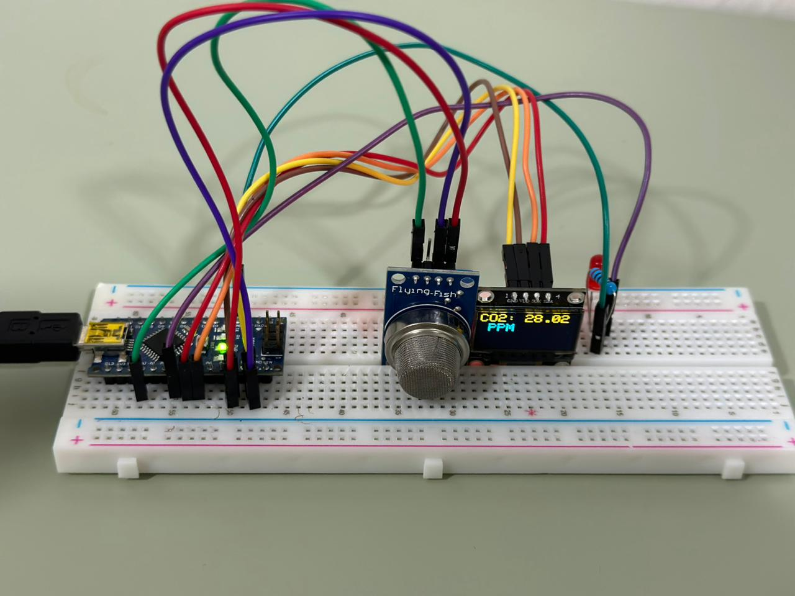
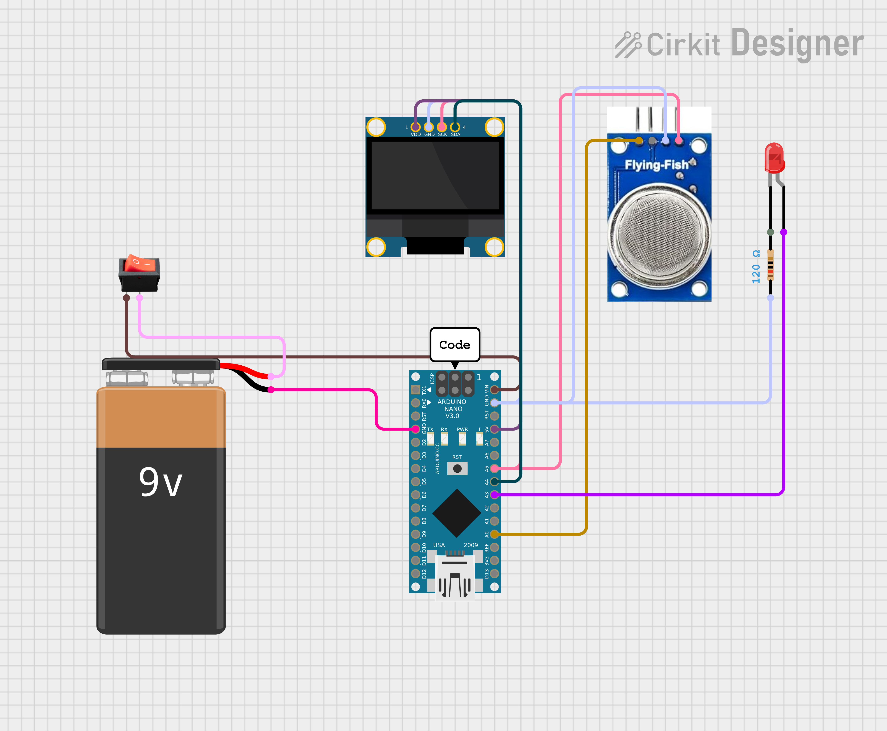
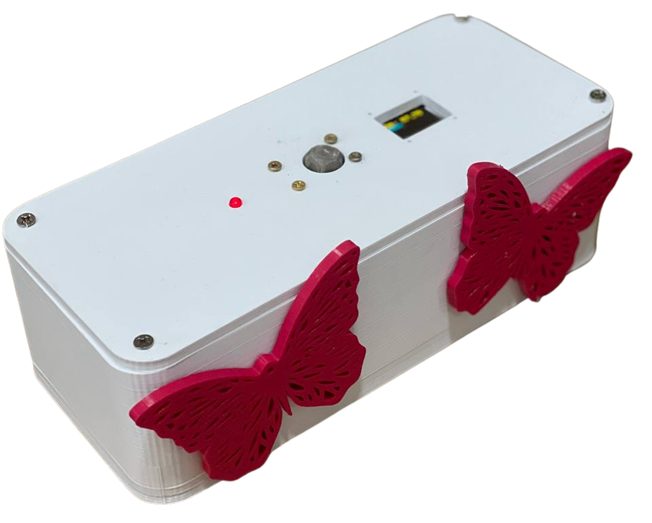

# CO2 Emissions Detector
A portable atmospheric CO2 monitoring device built with Arduino Nano and the MQ-135 sensor designed to measure real-time CO2 levels, display them on an OLED screen, and trigger a red LED alert when emissions exceed a critical threshold.

---

## Overview
Rising CO2 emissions are one of the greatest environmental challenges today, contributing to global warming, health risks, and disrupted weather patterns. Saudi Arabia's CO2 emissions reached **584 million metric tons** in 2021 and continue to rise. This project provides an affordable, portable solution: a battery-powered detector that continuously monitors atmospheric CO2 levels and alerts users when concentrations exceed **1000 ppm** without requiring expensive lab equipment.

---

## Features
-  **Real-time CO2 monitoring** via MQ-135 air quality sensor
-  **OLED display** showing live CO2 concentration in PPM
-  **Red LED alert** triggered when CO2 exceeds 1000 ppm
-  **Battery-powered** with a 9V battery and on/off switch
-  **Custom 3D-printed enclosure** designed in SolidWorks, printed in PLA
-  **Affordable build** — accessible in low-resource environments

---

## Tools & Technologies

| Category | Tool / Component |
|---|---|
| Microcontroller | Arduino Nano |
| Sensor | MQ-135 Air Quality Sensor |
| Display | 0.96" OLED Screen (SSD1306, I2C) |
| Alert | Red LED + 120Ω Resistor |
| Power | 9V Battery + Toggle Switch |
| Enclosure | 3D-Printed PLA (Ender 3 V2) |
| Programming | Arduino IDE |
| Libraries | MQ135.h, Adafruit_SSD1306.h, Adafruit_GFX.h, Wire.h |
| CAD Design | SolidWorks + Ultimaker Cura |
| Circuit Design | Cirkit Designer |

---

## How It Works

The system uses the **MQ-135 resistive gas sensing** method:

1. The MQ-135 sensor detects CO2 and other gases via a change in electrical resistance
2. The Arduino Nano reads the analog output and converts it to a PPM value using the MQ135 library
3. The CO2 reading is displayed on the OLED screen every 2 seconds
4. If the reading exceeds **1000 ppm**, the red LED turns on as a visual alert
5. When levels drop back below the threshold, the LED turns off automatically

---

## Gallery

### 🔌 Circuit Implementation & Diagram

  <table>
    <tr>
      <td align="center"><b>Circuit Implementation</b></td>
      <td align="center"><b>Circuit Diagram</b></td>
    </tr>
    <tr>
      <td></td>
      <td></td>
    </tr>
  </table>

---

### 🖨️ Enclosure & Final Assembly

  <table>
    <tr>
      <td align="center"><b>Final Assembled Device</b></td>
    </tr>
    <tr>
      <td></td>
    </tr>
  </table>

---

## Documentation

| Document | Description |
|---|---|
| [📄 Full Report](docs/COE202_Report.pdf) | Complete technical report |
| [📄 Course Poster](docs/COE202_Poster.pdf) | COE-202 Poster |
| [📐 Enclosure Drawing](hardware/final_box.PDF) | SolidWorks assembly drawing |

---

## Team

| Name | Role |
|---|---|
| Sultanah Almutairi | Hardware & Software Development |
| Maryam Alaloan | Hardware & Software Development |
| Reef Alroqeei | Hardware & Software Development |
| Eng. Sabrina Khelifa | Project Supervisor |

**Course:** Digital Logic Design — COE-202  
**Year:** 2023–2024

---

## License

This work is licensed under **Creative Commons Attribution-NonCommercial-NoDerivatives 4.0 International (CC BY-NC-ND 4.0)**.

© 2024 Sultanah Almutairi, Maryam Alaloan, Reef Alroqeei

